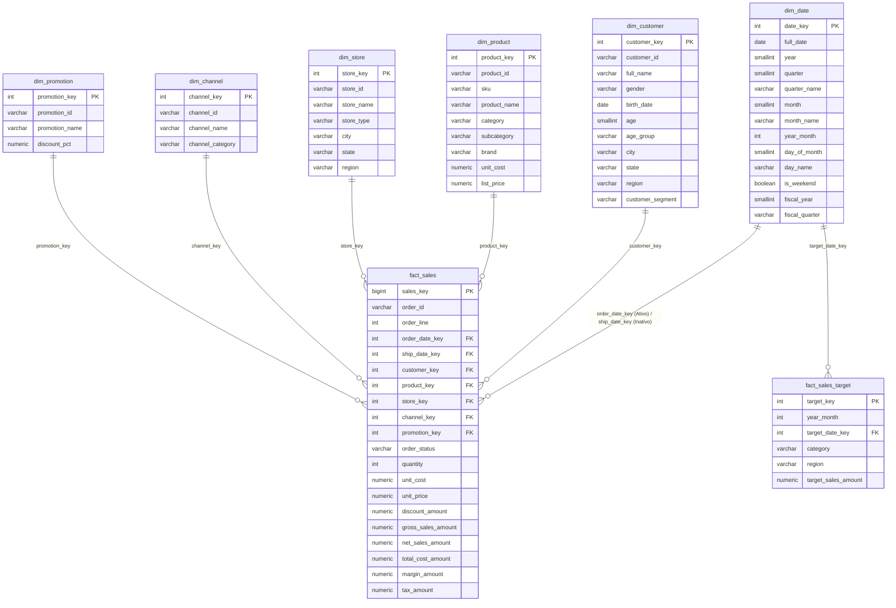

# 🚀 Projeto BI DirectQuery - PostgreSQL & Power BI (Preparação PL-300)

Um projeto completo de Business Intelligence projetado para relatórios analíticos em **DirectQuery** conectado diretamente ao **PostgreSQL**, utilizando arquitetura **Star Schema**, containerização **Docker Alpine**, boas práticas de modelagem dimensional e preparação avançada para o exame **Microsoft Certified: Power BI Data Analyst Associate (PL-300)**.

---

## 📊 Arquitetura do Modelo Dimensional (Star Schema)



---

## 📁 Estrutura do Projeto

```
projeto-bi-directquery/
├── .gitignore                          # Ignora volumes, .env e arquivos temporários
├── .env.example                        # Template de variáveis de ambiente
├── .env                                # Configuração ativa local
├── Dockerfile                          # Imagem customizada PostgreSQL 16 Alpine
├── docker-compose.yml                  # Orquestração do container do banco
├── README.md                           # Documentação central do projeto
├── config/
│   └── postgresql.conf                 # Ajustes de performance para analytics (work_mem, SSD, workers)
├── sql/
│   ├── 01_init_schema.sql              # DDL: Schemas, PKs, FKs e Índices B-tree
│   ├── 02_seed_dimensions.sql          # DML: Carga de dimensões (Datas, Clientes, Produtos, Lojas, Canais)
│   ├── 03_seed_facts.sql               # DML: Carga de 350.000+ vendas e metas comerciais
│   ├── 04_create_views.sql             # Views e tabela agregada para Modelos Compostos
│   ├── 05_security_roles.sql           # Usuário de leitura exclusivo para Power BI (pbi_user)
│   └── 06_live_stream_generator.sql    # Engine PL/pgSQL para simulação de vendas live
├── powerbi/
│   ├── directquery_guide.md            # Passo a passo de conexão e boas práticas PL-300
│   ├── live_dashboard_setup.md         # Guia de construção do Dashboard em tempo real (APR)
│   └── sample_dax_measures.dax         # Fórmulas DAX prontas (Histórico + Streaming Live)
├── scripts/
│   ├── dashboard_live.py               # Servidor web local com dashboard em tempo real (porta 8080)
│   ├── simulate_live_sales.ps1         # Simulador de streaming contínuo em PowerShell
│   └── simulate_live_sales.py          # Simulador alternativo em Python
└── docs/
    └── star_schema_data_dictionary.md  # Dicionário completo de dados e regras de negócio
```

---

## ⚡ Volume de Dados Gerado

- **`dw.fact_sales`**: **350.000** registros de vendas com sazonalidade, custos, descontos e margens.
- **`dw.dim_customer`**: **10.000** clientes distribuídos em regiões e segmentos corporativos/varejo.
- **`dw.dim_date`**: **1.826** dias (2022 a 2026) com ano fiscal, trimestres e atributos temporais.
- **`dw.dim_product`**: **500** produtos categorizados com preços e custos realistas.
- **`dw.fact_sales_target`**: **1.800** metas mensais por categoria e região para análise de desvio.
- **`dw.dim_store`**: **30** filiais e centros de distribuição por todo o Brasil.
- **`dw.agg_sales_monthly`**: **3.024** linhas pré-agregadas para laboratório de **Modelos Compostos (Composite Models)**.

---

## 🛠️ Como Iniciar o Projeto

### 1. Pré-requisitos
- [Docker Desktop](https://www.docker.com/) instalado e rodando.
- [Git](https://git-scm.com/) instalado.
- [Power BI Desktop](https://powerbi.microsoft.com/desktop/) instalado.

### 2. Subir o Banco de Dados com Docker Compose
No terminal PowerShell ou Bash, na raiz do projeto:

```powershell
docker compose up -d --build
```

O container inicializará e executará os scripts SQL automaticamente na primeira inicialização.

Para verificar se os dados foram povoados com sucesso:
```powershell
docker exec pbi-postgres-dw psql -U postgres -d dw_sales -c "SELECT schemaname, relname, n_live_tup FROM pg_stat_user_tables ORDER BY n_live_tup DESC;"
```

---

## 🔌 Conectando o Power BI Desktop (DirectQuery)

1. No Power BI Desktop, selecione **Obter Dados** -> **PostgreSQL**.
2. Parâmetros de Conexão:
   - **Servidor:** `localhost:5433` *(Porta 5433 configurada para não conflitar com bancos existentes)*
   - **Banco de dados:** `dw_sales`
   - **Modo de Conectividade:** **DirectQuery**
3. Autenticação (Aba **Banco de Dados**):
   - **Usuário:** `pbi_user`
   - **Senha:** `pbi_pass_123`
5. Consulte o arquivo [powerbi/directquery_guide.md](powerbi/directquery_guide.md) para configurar os relacionamentos, ativar a **Integridade Referencial** e usar as medidas prontas de [powerbi/sample_dax_measures.dax](powerbi/sample_dax_measures.dax).

---

## ⚡ Testando Atualizações em Tempo Real (Live DirectQuery)

Para testar se o DirectQuery está respondendo instantaneamente a novos dados no PostgreSQL, você dispõe de duas ferramentas integradas:

### 1. Monitor Web Interativo em Tempo Real
Inicie o servidor de monitoramento e abra no navegador:
```bash
python scripts/dashboard_live.py
```
- Acesse: **[http://localhost:8080](http://localhost:8080)**
- A tela exibirá KPIs, gráficos por categoria/região e um **feed com as últimas compras inseridas**.
- Clique no botão **"➕ Injetar Pedido Simulado"** ou veja a tela atualizar sozinha a cada 3 segundos!

### 2. Simulador de Vendas em Streaming (PowerShell / Python)
Em um terminal separado, execute o simulador contínuo de vendas:
```powershell
# Modo streaming contínuo (1 pedido a cada 3 segundos):
.\scripts\simulate_live_sales.ps1 -IntervalSeconds 3

# Ou gere um lote instantâneo de 15 pedidos:
.\scripts\simulate_live_sales.ps1 -Batch 15
```

### 3. Visualização no Power BI Desktop com Atualização Automática de Página (APR)
Siga o guia [powerbi/live_dashboard_setup.md](powerbi/live_dashboard_setup.md) para configurar a **Atualização Automática de Página** (a cada 5 segundos) no Power BI Desktop. Os cartões de *Vendas Hoje*, *Pedidos Hoje* e a tabela de últimos pedidos atualizarão automaticamente na sua tela conforme o simulador roda!

---

## 🎯 Tópicos da Certificação PL-300 Cobertos

1. **Modelagem Dimensional Star Schema:** Eliminação de relações Snowflake normalizadas, centralizando dados em fatos e dimensões conformadas.
2. **Otimização DirectQuery:** Uso de chaves substitutas inteiras, criação de índices B-tree nas Foreign Keys e ativação de *"Garantir Integridade Referencial"* (`INNER JOIN` folding).
3. **Role-Playing Dimensions & `USERELATIONSHIP`:** Gerenciamento de múltiplas datas na mesma tabela fato (`order_date_key` vs `ship_date_key`).
4. **Resolução de Granularidades Mistas:** Comparativo entre vendas diárias (`fact_sales`) e metas mensais (`fact_sales_target`).
5. **Modelos Compostos e Agregações:** Combinação de Import Mode (`agg_sales_monthly`) e DirectQuery (`fact_sales`) via diálogo *"Gerenciar Agregações"*.
6. **Segurança Corporativa:** Utilização de usuário de leitura com privilégios restritos (`pbi_user`).

---

## 📦 Versionamento Git e Backup no GitHub

Este projeto já está inicializado com repositório Git local. Para realizar o backup no seu GitHub:

```bash
git remote add origin https://github.com/andre-fanelli/bi-directquery.git
git branch -M main
git push -u origin main
```
